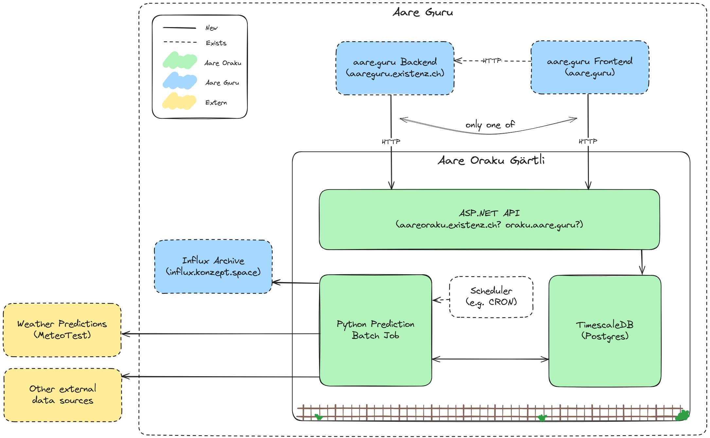

# MVP Design

**Hinweis:** Das ist das originale MVP design, die aktuelle Umsetzung sieht leicht anders aus (z.B. kein .NET).
Die Dokumentation für den produktiven MVP folgt.

## Anforderungen für Integration (priorisiert)

- API Zugriff auf aktuelle Vorhersagen
- Caching von Vorhersagen
- Persistieren von Vorhersagen und allen verwendeten Daten

## System Architecture

Drei neue Software Komponente werden für das Aare Oraku benötigt.

### Python Prediction Batch Job

Dieser Job wird periodisch ausgeführt und führt folgende Schritte durch.

1. Benötigte Daten werden von externen Datenquellen bezogen, allenfalls transformiert und in der TimescaleDB persistiert.
2. Die bereits verfügbaren und neu heruntergeladenen Daten werden einem Vorhersagemodell übergeben und dessen Vorhersage in der TimescaleDB persistiert.

Jeder Durchlauf des Jobs soll Nachvollziehbar sein, das heisst, es werden keine Daten überschrieben und überschneidene Perioden sind mithilfe einer Job-ID oder Job-Timestamp zu unterscheiden.

### ASP.NET API

Die API liefert die Vorhersagen, die in der TimescaleDB abgelegt sind, über HTTP.

Die initiale Idee für den Endpunkt ist:

#### `/prediction?at=TIMESTAMP&horizon=24`

Liefert die neuste Vorhersage, die vor dem angegebenen Timestamp gemacht wurde (kann auch weggelassen werden, dann einfach neuste). Timestamp in der Zukunft nicht erlaubt.
Liefert so viele Datenpunkte wie per `horizon` gewünscht, wenn nicht möglich `Bad Request`.

Response ist columnar, also `time: []`, `temp: []` und enthält `metadata` mit `predictionTime`, Versionen und so.

Gedanken zu Prediction Bands noch nicht nötig aber würden wahrscheinlich zusätzliche Spalten dann.

### TimescaleDB

Postgres-basierte TimeSeries Datenbank, die sowohl alle Vorhersagen als auch die dafür benötigten externen Daten historisiert.
Dient entsprechend auch als "Cache" für die API.

## Deployment

Alles Docker- bzw. OCI-basiert. Mehr ist noch nicht klar.

### Job Scheduling

Für den Batch Job braucht es ein Scheduling. Wenn möglich wird das direkt in der Deployment Plattform, z.B. Dokku oder Kubernetes eingerichtet. Falls ein Server oder VPS gewählt wird, würde vermutlich CRON verwendet. \
Nach aktueller Idee wäre das Scheduling auf Orchestrator-Ebene, das heisst, eine Container-Instanz würde hochgefahren, läuft bis die Vorhersage persistiert ist, dann fährt die Instanz wieder runter. Eine Alternative mit konstant laufender Instanz, die durch etwas angetriggert wird, ist für diesen Fall voraussichtlich weniger angebracht.

### Scaling

Für MVP eigentlich auch noch nicht wichtig aber mit dieser Architektur könnte alles individuell skaliert werden, je nach Bedarf ist.

## Modell

Das Vorhersagemodell für den MVP hat tiefe Anforderungen und wird nicht perfekt sein. Es muss

1. mind. 24h in die Zukunft Vorhersagen machen
2. möglichst wenige Datenquellen haben, damit MVP bald mal läuft
3. eine eval MAE mit 4 Tage Horizont von < 0.5 °C haben \
   Kontext: beste Baseline ist bei ~0.58 und bisher bestes LR-Modell war bei ~0.35

Zudem gelten die initialen Spezifikationen von [specs.md](./specs.md) heisst

- nur Bern, Schönau (2135)
- Auflösung: 1h
- reicht, wenn es einmal täglich läuft (und sonst schlechte Perf hat)
